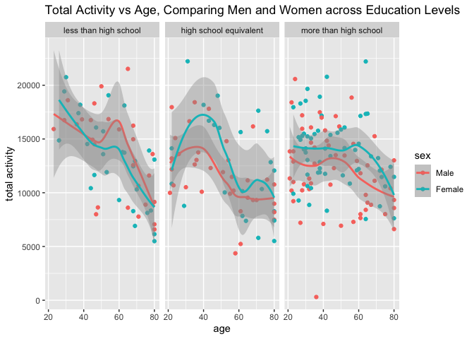
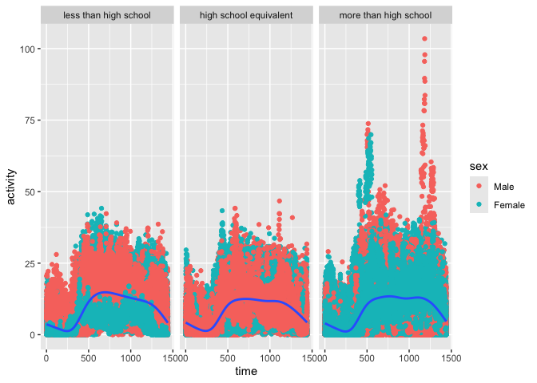
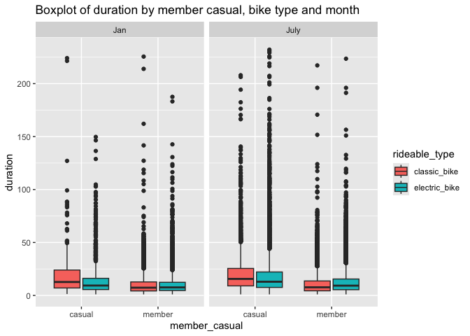

p8105_hw3_yy3563
================
Yifei Yu
2024-10-12

``` r
library(dplyr)
```

    ## 
    ## Attaching package: 'dplyr'

    ## The following objects are masked from 'package:stats':
    ## 
    ##     filter, lag

    ## The following objects are masked from 'package:base':
    ## 
    ##     intersect, setdiff, setequal, union

``` r
library(tidyverse) 
```

    ## ── Attaching core tidyverse packages ──────────────────────── tidyverse 2.0.0 ──
    ## ✔ forcats   1.0.0     ✔ readr     2.1.5
    ## ✔ ggplot2   3.5.1     ✔ stringr   1.5.1
    ## ✔ lubridate 1.9.3     ✔ tibble    3.2.1
    ## ✔ purrr     1.0.2     ✔ tidyr     1.3.1

    ## ── Conflicts ────────────────────────────────────────── tidyverse_conflicts() ──
    ## ✖ dplyr::filter() masks stats::filter()
    ## ✖ dplyr::lag()    masks stats::lag()
    ## ℹ Use the conflicted package (<http://conflicted.r-lib.org/>) to force all conflicts to become errors

``` r
library(patchwork)
library(haven)
library(ggplot2)
library(readxl)
```

## Problem 1

``` r
library(p8105.datasets)
data("ny_noaa")
```

``` r
head(ny_noaa)
```

    ## # A tibble: 6 × 7
    ##   id          date        prcp  snow  snwd tmax  tmin 
    ##   <chr>       <date>     <int> <int> <int> <chr> <chr>
    ## 1 US1NYAB0001 2007-11-01    NA    NA    NA <NA>  <NA> 
    ## 2 US1NYAB0001 2007-11-02    NA    NA    NA <NA>  <NA> 
    ## 3 US1NYAB0001 2007-11-03    NA    NA    NA <NA>  <NA> 
    ## 4 US1NYAB0001 2007-11-04    NA    NA    NA <NA>  <NA> 
    ## 5 US1NYAB0001 2007-11-05    NA    NA    NA <NA>  <NA> 
    ## 6 US1NYAB0001 2007-11-06    NA    NA    NA <NA>  <NA>

``` r
dim(ny_noaa)
```

    ## [1] 2595176       7

``` r
str(ny_noaa)
```

    ## tibble [2,595,176 × 7] (S3: tbl_df/tbl/data.frame)
    ##  $ id  : chr [1:2595176] "US1NYAB0001" "US1NYAB0001" "US1NYAB0001" "US1NYAB0001" ...
    ##  $ date: Date[1:2595176], format: "2007-11-01" "2007-11-02" ...
    ##  $ prcp: int [1:2595176] NA NA NA NA NA NA NA NA NA NA ...
    ##  $ snow: int [1:2595176] NA NA NA NA NA NA NA NA NA NA ...
    ##  $ snwd: int [1:2595176] NA NA NA NA NA NA NA NA NA NA ...
    ##  $ tmax: chr [1:2595176] NA NA NA NA ...
    ##  $ tmin: chr [1:2595176] NA NA NA NA ...
    ##  - attr(*, "spec")=
    ##   .. cols(
    ##   ..   id = col_character(),
    ##   ..   date = col_date(format = ""),
    ##   ..   prcp = col_integer(),
    ##   ..   snow = col_integer(),
    ##   ..   snwd = col_integer(),
    ##   ..   tmax = col_character(),
    ##   ..   tmin = col_character()
    ##   .. )

``` r
summary(ny_noaa)
```

    ##       id                 date                 prcp               snow       
    ##  Length:2595176     Min.   :1981-01-01   Min.   :    0.00   Min.   :  -13   
    ##  Class :character   1st Qu.:1988-11-29   1st Qu.:    0.00   1st Qu.:    0   
    ##  Mode  :character   Median :1997-01-21   Median :    0.00   Median :    0   
    ##                     Mean   :1997-01-01   Mean   :   29.82   Mean   :    5   
    ##                     3rd Qu.:2005-09-01   3rd Qu.:   23.00   3rd Qu.:    0   
    ##                     Max.   :2010-12-31   Max.   :22860.00   Max.   :10160   
    ##                                          NA's   :145838     NA's   :381221  
    ##       snwd            tmax               tmin          
    ##  Min.   :   0.0   Length:2595176     Length:2595176    
    ##  1st Qu.:   0.0   Class :character   Class :character  
    ##  Median :   0.0   Mode  :character   Mode  :character  
    ##  Mean   :  37.3                                        
    ##  3rd Qu.:   0.0                                        
    ##  Max.   :9195.0                                        
    ##  NA's   :591786

The `ny_noaa` dataset includes variables such as `id`, `date`, `prcp`,
`snow`, `snwd`, `tmax`, and `tmin`. There are 2595176 observations in
the dataset. There are 2595176 rows and 7 columns. `id`, `tmax`, and
`tmin` are characters. `prcp`, `snow`, and `snwd` are integers.

``` r
sapply(ny_noaa, function(x) sum(is.na(x)))
```

    ##      id    date    prcp    snow    snwd    tmax    tmin 
    ##       0       0  145838  381221  591786 1134358 1134420

``` r
sum(is.na(ny_noaa))
```

    ## [1] 3387623

We can see that `id` and `date` have no missing value, while `prcp` has
145838 missing value, `snow` has 381221, `snwd` has 591786, `tmax` has
1134358, and `tmin` has 1134420 missing value. The overall number of
missing value is 3387623. Both `tmax` and `tmin` have a lot of missing
value, which may lead to issues when analyzing data.

#### Clean the data

``` r
ny_noaa_clean = ny_noaa |> 
  mutate(
    year = year(date),
    month = month(date),
    day = day(date)
  ) |> 
  mutate(
    tmax = as.numeric(as.character(tmax)),
    tmin = as.numeric(as.character(tmin))
  ) |> 
  mutate(
    tmax = tmax / 10,
    tmin = tmin / 10
  ) |> 
  mutate(
    prcp = prcp / 10,
    snow = snow /10,
    snwd = snwd /10
  )
```

#### Find the most commonly observed values for snowfall.

``` r
common_snowfall = ny_noaa_clean |> 
  group_by(snow) |> 
  summarize(count = n()) |> 
  arrange(desc(count))

head(common_snowfall)
```

    ## # A tibble: 6 × 2
    ##    snow   count
    ##   <dbl>   <int>
    ## 1   0   2008508
    ## 2  NA    381221
    ## 3   2.5   31022
    ## 4   1.3   23095
    ## 5   5.1   18274
    ## 6   7.6   10173

The most commonly observed values for snowfall is 0. This because
snowfall occurs only during winter and only happen in certain regions.
This would result in a high frequency of zero values in the dataset.

#### Create the Two-Panel Plot

``` r
ny_noaa_clean |> 
  filter(month %in% c(1, 7)) |> 
  group_by(id, year, month) |> 
  summarize(mean_tmax = mean(tmax, na.rm = TRUE)) |> 
  ggplot(aes(x = year, y = mean_tmax, color = id)) +
  geom_point(show.legend = F) +
  facet_grid(. ~ month)
```

    ## `summarise()` has grouped output by 'id', 'year'. You can override using the
    ## `.groups` argument.

    ## Warning: Removed 5970 rows containing missing values or values outside the scale range
    ## (`geom_point()`).

<!-- -->

The average tmax in January show a much larger spread compared to July.
Both of the months show a consistent pattern. There are a few outliers
below -10°C in January. These could be caused by extremely cold days.
There is one outlier in July where the station was recorded below 15.

#### tmax vs tmin

``` r
ny_noaa_clean |> 
  ggplot(aes(x = tmin, y = tmax)) +
  geom_hex() 
```

    ## Warning: Removed 1136276 rows containing non-finite outside the scale range
    ## (`stat_binhex()`).

<!-- -->

#### Plot showing the distribution of snowfall values greater than 0 and less than 100 separately by year

``` r
ny_noaa_clean |> 
  filter(snow > 0 & snow < 100) |> 
  mutate(year = factor(year)) |> 
  ggplot(aes(x = year, y = snow)) +
  geom_boxplot()
```

<!-- -->

## Problem 2

Import the two datasets.

``` r
demographic = 
  read_csv("data/nhanes_covar.csv", skip = 4) |> 
  janitor::clean_names()
```

    ## Rows: 250 Columns: 5
    ## ── Column specification ────────────────────────────────────────────────────────
    ## Delimiter: ","
    ## dbl (5): SEQN, sex, age, BMI, education
    ## 
    ## ℹ Use `spec()` to retrieve the full column specification for this data.
    ## ℹ Specify the column types or set `show_col_types = FALSE` to quiet this message.

``` r
accel = read_csv("data/nhanes_accel.csv") |> 
  janitor::clean_names()
```

    ## Rows: 250 Columns: 1441
    ## ── Column specification ────────────────────────────────────────────────────────
    ## Delimiter: ","
    ## dbl (1441): SEQN, min1, min2, min3, min4, min5, min6, min7, min8, min9, min1...
    ## 
    ## ℹ Use `spec()` to retrieve the full column specification for this data.
    ## ℹ Specify the column types or set `show_col_types = FALSE` to quiet this message.

Merge two datasets.

``` r
final_df = left_join(demographic, accel, by = "seqn")
```

organize the data

``` r
final_df = final_df |> 
  filter(age >= 21) |> 
  drop_na(sex, age, bmi, education) |> 
  mutate(
    sex = factor(sex, levels = c(1, 2), labels = c("Male", "Female")),
    education = factor(education, 
                       levels = c(1, 2, 3), 
                       labels = c("less than high school", "high school equivalent", "more than high school")),
    education = fct_relevel(education, "less than high school", "high school equivalent", "more than high school")
  )  
```

men and women

``` r
final_df |> 
  group_by(sex, education) |> 
  summarize(n_obs = n()) |> 
  knitr::kable()
```

    ## `summarise()` has grouped output by 'sex'. You can override using the `.groups`
    ## argument.

| sex    | education              | n_obs |
|:-------|:-----------------------|------:|
| Male   | less than high school  |    27 |
| Male   | high school equivalent |    35 |
| Male   | more than high school  |    56 |
| Female | less than high school  |    28 |
| Female | high school equivalent |    23 |
| Female | more than high school  |    59 |

``` r
final_df |> 
  ggplot(aes(x = age, fill = sex)) +
  geom_density(alpha = 0.3) + 
  facet_grid(. ~ education) +
  labs(
    title = "Age Distributions for Men and Women by Education Category",
    x = "age",
    y = "density",
    fill = "sex"
  ) +
   theme_minimal()
```

<!-- -->

create total activity variable

``` r
final_df$total_activity <- rowSums(final_df %>% select(starts_with("min")), na.rm = TRUE)
```

plot total activity

``` r
final_df |> 
  ggplot(aes(x = age, y = total_activity, color = sex)) +
  geom_point() +
  geom_smooth() +
  facet_grid(. ~ education) +
  labs(
    title = "Total Activity vs Age, Comparing Men and Women across Education Levels",
    x = "age",
    y = "total activity",
    color = "sex"
  ) 
```

    ## `geom_smooth()` using method = 'loess' and formula = 'y ~ x'

<!-- -->

Total activity tends to decrease with age across all education levels.
Higher education levels are associated with less steep declines in
activity with age. Women generally have higher total activity levels
compared to men in younger and middle-age.

three-panel plot

``` r
final_df |> 
  pivot_longer(
    cols = min1:min1440,
    names_to = "time",
    values_to = "activity"
  ) |> 
  mutate(time=parse_number(time)) |> 
  ggplot(aes(x = time, y = activity)) +
  geom_point(aes(color = sex)) +
  geom_smooth() +
  facet_grid(. ~ education)
```

    ## `geom_smooth()` using method = 'gam' and formula = 'y ~ s(x, bs = "cs")'

<!-- -->

## Problem 3

import data

``` r
Jan2020 = 
  read_csv("data/citibike/Jan 2020 Citi.csv") |> 
  janitor::clean_names()
```

    ## Rows: 12420 Columns: 7
    ## ── Column specification ────────────────────────────────────────────────────────
    ## Delimiter: ","
    ## chr (6): ride_id, rideable_type, weekdays, start_station_name, end_station_n...
    ## dbl (1): duration
    ## 
    ## ℹ Use `spec()` to retrieve the full column specification for this data.
    ## ℹ Specify the column types or set `show_col_types = FALSE` to quiet this message.

``` r
Jan2024 = 
  read_csv("data/citibike/Jan 2024 Citi.csv") |> 
  janitor::clean_names()
```

    ## Rows: 18861 Columns: 7
    ## ── Column specification ────────────────────────────────────────────────────────
    ## Delimiter: ","
    ## chr (6): ride_id, rideable_type, weekdays, start_station_name, end_station_n...
    ## dbl (1): duration
    ## 
    ## ℹ Use `spec()` to retrieve the full column specification for this data.
    ## ℹ Specify the column types or set `show_col_types = FALSE` to quiet this message.

``` r
July2020 = 
  read_csv("data/citibike/July 2020 Citi.csv") |> 
  janitor::clean_names()
```

    ## Rows: 21048 Columns: 7
    ## ── Column specification ────────────────────────────────────────────────────────
    ## Delimiter: ","
    ## chr (6): ride_id, rideable_type, weekdays, start_station_name, end_station_n...
    ## dbl (1): duration
    ## 
    ## ℹ Use `spec()` to retrieve the full column specification for this data.
    ## ℹ Specify the column types or set `show_col_types = FALSE` to quiet this message.

``` r
July2024 = 
  read_csv("data/citibike/July 2024 Citi.csv") |> 
  janitor::clean_names()
```

    ## Rows: 47156 Columns: 7
    ## ── Column specification ────────────────────────────────────────────────────────
    ## Delimiter: ","
    ## chr (6): ride_id, rideable_type, weekdays, start_station_name, end_station_n...
    ## dbl (1): duration
    ## 
    ## ℹ Use `spec()` to retrieve the full column specification for this data.
    ## ℹ Specify the column types or set `show_col_types = FALSE` to quiet this message.

``` r
Jan2020$Year <- 2020
Jan2020$Month <- "Jan"
Jan2024$Year <- 2024
Jan2024$Month <- "Jan"

July2020$Year <- 2020
July2020$Month <- "July"
July2024$Year <- 2024
July2024$Month <- "July"

citi_bike <- bind_rows(Jan2020, Jan2024, July2020, July2024)
```

#### table showing the total number of rides in each combination of year and month separating casual riders and Citi Bike members

``` r
citi_bike |> 
  group_by(member_casual, Year, Month) |> 
  summarize(rides = n()) |> 
  knitr::kable()
```

    ## `summarise()` has grouped output by 'member_casual', 'Year'. You can override
    ## using the `.groups` argument.

| member_casual | Year | Month | rides |
|:--------------|-----:|:------|------:|
| casual        | 2020 | Jan   |   984 |
| casual        | 2020 | July  |  5637 |
| casual        | 2024 | Jan   |  2108 |
| casual        | 2024 | July  | 10894 |
| member        | 2020 | Jan   | 11436 |
| member        | 2020 | July  | 15411 |
| member        | 2024 | Jan   | 16753 |
| member        | 2024 | July  | 36262 |

Based on the table generated above, both casual riders and members have
shown significant growth in the number of rides from 2020 to 2024. Both
casual riders and members show higher activity in July compared to
January for both years, season plays a significant role.

#### table showing the 5 most popular starting stations for July 2024

``` r
July2024 |> 
  group_by(start_station_name) |> 
  summarize(rides = n()) |> 
  arrange(desc(rides)) |> 
  head(5) |> 
  knitr::kable(
    caption="Top 5 most popular starting stations for July 2024",
    col.names = c("Start Station Name", "Number of rides")
  )
```

| Start Station Name       | Number of rides |
|:-------------------------|----------------:|
| Pier 61 at Chelsea Piers |             163 |
| University Pl & E 14 St  |             155 |
| W 21 St & 6 Ave          |             152 |
| West St & Chambers St    |             150 |
| W 31 St & 7 Ave          |             146 |

Top 5 most popular starting stations for July 2024

#### plot to investigate the effects of day of the week, month, and year on median ride duration

``` r
citi_bike |> 
  mutate(
    Year = factor(Year),
    Month = factor(Month)
  ) |> 
  ggplot(aes(x = Month, y = duration, fill = weekdays)) +
  geom_boxplot() +
  facet_grid(. ~ Year)
```

<!-- -->

July in both 2020 and 2024 has much more variability compared to Jun,
showing that the warm summer have a greater variety of ride durations.
Weekdays show a relatively consistent median ride duration across both
years and months.

#### figure shows the impact of month, membership status, and bike type on the distribution of ride duration in 2024

``` r
citi_bike |> 
  filter(Year == "2024") |> 
  mutate(
    Year = factor(Year),
    Month = factor(Month)
  ) |> 
  ggplot(aes(x = member_casual, y = duration, fill = rideable_type)) +
  geom_boxplot() +
  facet_grid(. ~ Month)
```

<!-- -->

Classic bikes generally have a wider distribution of ride durations
compared to electric bikes. Casual riders show more variability in their
ride durations.
